# Language sampling

SIGTYP lecture series  
Tanja Samardžić (University of Zurich)  
24.09.2021

### Learning goals

- Big picture: what is common to linguistics and NLP? 
- Scientific perspective 
- How-to tips for future study designs 

### Overview

- General sampling refresh  
- The purpose of sampling in linguistics and NLP
- Describing languages for stratified sampling
- Describing texts (data) for stratified sampling
- MorphDiv project: sampling texts for 100 languages (WALS 100LC)
- How-to

---
## PART 1

---

### 1. Sampling basics

Whenever we perform an experiment to test a model or a hypothesis, we need to decide what data to include. In linguistics and NLP, this means selecting a number of **languages** and a number of examples (sounds, words, utterances, texts) from each language. In this lecture, we will consider **texts** to be sampling examples.   How do we take this decision?

Good samples should represent the whole population that we want to study or model. 

 

####  Random sampling 

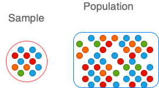

> Enumerate all the texts (past and future) in all languages (population), then select N texts randomly (sample)  
  
  &nbsp; &nbsp;  **->** &nbsp; &nbsp; Clearly impossible!

 

#### Stratified sampling

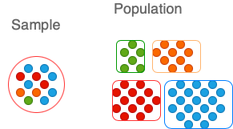

 > Enumerate all languages (population), then select N languages randomly (sample), then for each language, enumerate all the texts (population), then select N texts randomly (sample)  
  
  &nbsp; &nbsp;  **->** &nbsp; &nbsp; Starting to look imaginable, if we get lucky with the languages so that their texts are enumerable (not too many not to few) 

Samples can be more stratified. This is, for instance, what is often done: 

> Enumerate all kinds (groups, classes) of languages, then select N kinds randomly. For each of the selected kinds, enumerate all languages and select Mi languages randomly (M is proportional to the size of the group). For each selected language, enumerate all the text and select N texts randomly.  

Stratified sampling is a really good trick for representing the population well in a small sample, but for it to work, we need to know our **strata**, that is what kinds of languages and texts there are.  

 

 

### 2. Why sampling  

#### in linguistics?

The goal of linguistics is to find out how **language (= all languages!)** works. For instance, one of my favourite topics is **language adaptation**, which offers some explanations of the differences in how languages organise words (morphological diversity). Some languages tend to be *splitters*, while others are **lumpers** (to borrow the terms from [Regier et al. 2016](https://journals.plos.org/plosone/article?id=10.1371/journal.pone.0151138)). Splitters have short and simple words (as in English), while lumpers have long and complex words. The work on language adaptation (e.g. [Lupyan and Dale 2010](https://journals.plos.org/plosone/article?id=10.1371/journal.pone.0008559), Nichols 2013[^1], [Bentz and Winter 2013](https://brill.com/view/journals/ldc/3/1/article-p1_1.xml)) shows that splitters are found in more interactive communities, while lumpers tend to be associated with more isolated communities. 

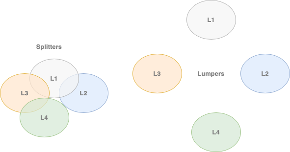

It is evident that testing such hypotheses requires diverse samples and a good representation of the whole language population. Such studies typically include hundreds of languages, but big samples do not ensure good generalisations. A good illustration of this fact is the controversy around the correlation between **phoneme inventory** and the **population size**. [Hay and Bauer (2007)](https://www.jstor.org/stable/40070846) found a positive correlation, but [Moran et al. (2011)](https://www.jstor.org/stable/23357556) reanalysed the data and found little evidence for the correlation. In short, it turned out that the correlation observed across the whole sample did not hold in smaller sub-samples.  

#### in NLP?

The ultimate goal of NLP applications is to assign a correct label (or representation) Y to any utterance X in any language.

Suppose we encounter a short text X (e.g. a Twitter message), here are some Ys that we want to get right with NLP:

- Is X positive or negative? &nbsp; &nbsp; &nbsp; &nbsp; Y = {positive, negative, neutral}
- What is the topic of X? &nbsp; &nbsp; &nbsp; &nbsp; Y = {politics, sport, music, ...}
- In what language is X? &nbsp; &nbsp; &nbsp; &nbsp; Y = {Abkhaz, Acoma, Alamblak, ...}
- What is the translation of X in a language I know?  &nbsp; &nbsp; &nbsp; &nbsp; Y = translated X
 

Typically, for each Y, we have a trained **model** that outputs it once we give it X as input. This model is trained on a **sample** of texts. Our X will come from a **population** that our model is supposed to get right. 

How well will we do on X? &nbsp; &nbsp; &nbsp; &nbsp; That depends on how smart our model is, but also on:

**->** &nbsp; &nbsp; **How different X is from what we included in our training sample**  

In theory, all trained models should work for all languages: we can train the same model on any language for which we have samples and it should output Ys for the language for which it is trained. So the goal of NLP applications working for all languages boils down to having samples of all languages. We just need one language in order to figure out the models then retrain them on any desired language and that's it! This idea makes a lot of sense, but it does not seem to work in practice.

#### in both?

The problem is that we cannot design models without assuming some properties of the particular language with which we are working, as convincingly shown by [Bender (2011)](https://journals.linguisticsociety.org/elanguage/lilt/article/download/2624/2624-5403-1-PB.pdf). For instance, lets look at the case of text **tokenisation**. 

 Segmenting text into words  -- something we had been doing for decades before subword tokenisation became popular -- is driven by a hidden assumption about the structure of language. If we spell out this assumption, it would be something like this:

> Words are atomic units of language. 

It is quite OK to assume this if words are relatively short and simple. But words are not short and simple in most of the languages so we need to give up this assumption, which is what actually happened when we moved to subword segmentation. This move opened up new questions regarding the granularity level: what subwords? Although we still don't know the answer, the systems are working better at arbitrary levels.  

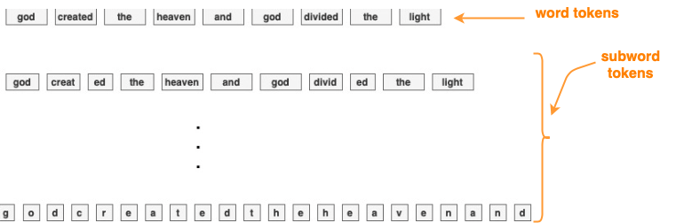

In order to be more objective, our samples need to represent, as much as possible **linguistic diversity**, that is different kinds of languages, both in linguistics and NLP. Diverse samples help us avoid assumptions that don't hold and do better. For instance, subword tokenisation was introduced in order to deal with long and complex words, but it turned out to be a better representation for all languages.  If we never thought about languages with long and complex words, we might have never found this out. 

 

---
## PART 2

---

### 3. Kinds of languages

 Describing different kinds of languages is often considered to be the main task of **linguistic typology**. This is a very hard task and, despite hundreds of years of efforts, still far from completed. The reason for this is that it is very hard to find the terms (categories) for describing languages in a comparable way ([Haspelmath 2007](https://zenodo.org/record/1133882/export/geojson#.YU3Sey0RrfY)). When describing physical objects (and beings), we can measure their height, weight, temperature, volume, etc. What do we measure in order to describe and compare languages? 

 Here is a recent classification of languages by [Joshi et al. (2020)](https://aclanthology.org/2020.acl-main.560.pdf)

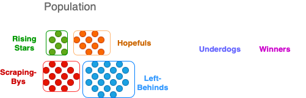

Can you guess what measure is the classification criterion here? 

For the purpose of sampling, it would be nice to be able to describe languages in a compact way using a single objective measure. For instance, we would like to be able to say something like:

> My sample consists of 
> -  5 languages of size 1
> -  6 languages of size 2 
> -  4 languages of size 3

For the moment, though, no such a measure is widely accepted. 

By the way, when talking about the *size of a language*, linguists seem to mean the *size of the population of its speakers*. This is a pity because estimating the size of a language in the sense similar to the *size of a model* could be much more interesting! 

Instead, we tend to describe languages in terms of their relation to other languages, which makes things rather complicated.  

 

#### Genealogical features

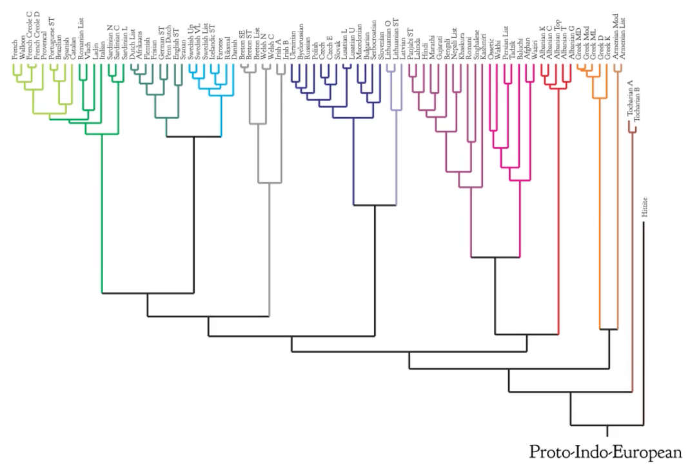

Source:

- [What trees can tell us about language evolution (and what they cannot)](https://tube.switch.ch/videos/f68d011e), SDS group, URPP Language and Space, UZH

The most common measure for describing languages is **genealogical relatedness** read off **phylogenetic trees** such as this one above. These trees are built using various knowledge sources (a little like family trees), but the most prominent techniques rely on the lists of cognates such as this example: 

> English: mother  
> Spanish: madre  
> German: mutter  
> Hindi: matri  
> Dutch: moeder  
> Latin: mater  
> Greek: meter  

The distance between two languages is measured as the number of cognates they share. It is  something like trying to guess who is whose cousin (and how closely related) looking at who resembles whom. 

When using phylogenetic trees for describing languages, we assume that closely related languages are similar. The fact that some language belongs to a certain group implies a set of properties (those shared by its group, usually not explicitly listed). We can group languages at different levels of granularity. However, the level that is predominately used is that of **family** (only one group in the tree above).

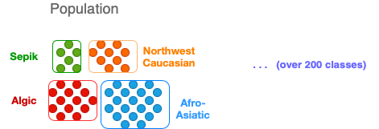

 

Some quotes:

- [Tan et al. 2019](https://aclanthology.org/D19-1089.pdf)
 
> We regard the languages in the same family as similar languages and group them into one cluster. 

- [Ponti et al. 2019](https://direct.mit.edu/coli/article/45/3/559/93372/Modeling-Language-Variation-and-Universals-A)

> 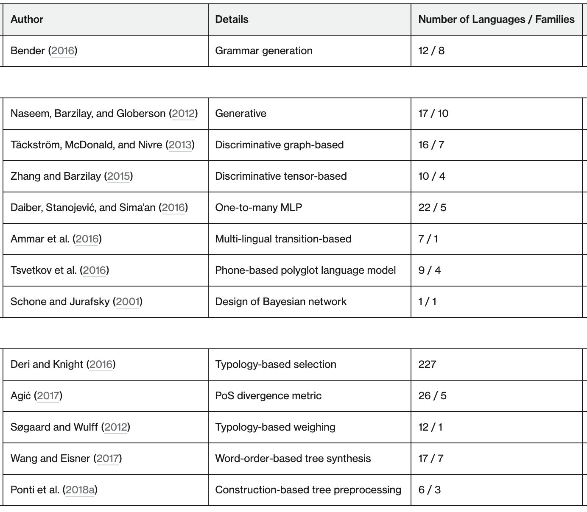

 

 

#### Grammar features 

Second most common approach is to embed languages in a space whose dimensions correspond to **[WALS features](https://wals.info/feature)**, 

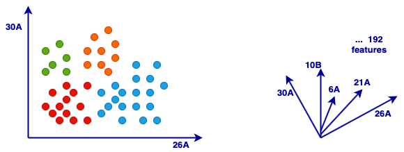

 

> **26A**  Prefixing vs. Suffixing in Inflectional Morphology

> Values: 
> -  Little or no inflectional morphology 
> -  Predominantly suffixing 
> -  Moderate preference for suffixing 
> -  Approximately equal amounts of suffixing and prefixing  
> -  Moderate preference for prefixing 
> -  Predominantly prefixing

> **30A** Number of Genders

> Values:
> -  None
> -  Two
> -  Three
> -  Four
> -  Five or more  

 

Once in a space, languages can be clustered into groups which need to be represented in a sample. This is rarely done in NLP (WALS features are used for other purposes), but some linguistic samples are constructed in a similar way ([Moran et al. 2016](https://aclanthology.org/L16-1700/)).  

#### Text features 

Text corpora can also bring some information useful for describing languages. A really simple metric easy to compute is **word length**

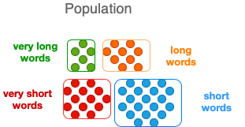

 

 

For instance, median word length for the languages in the [CoNLL-SIGMORPHON 2018 Shared Task](https://sigmorphon.github.io/sharedtasks/2018/), calculated on Wiki texts looks like this:

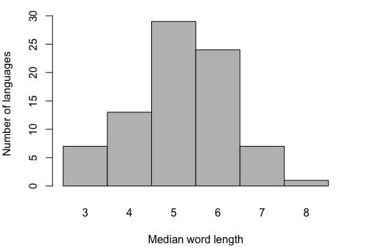

 

It seems like this value is symmetrically distributed across languages, which I think is an interesting observation in itself. In any case, we can take this distribution and split the languages into bins for stratified sampling.   

 

**Text complexity** is a quantity that is much more often discussed as a feature of languages, typically expressed using some measure of **entropy**. Here is how unigram entropy is distributed over the same languages as above. The shape of this distribution is rather different, but we know that word length and unigram entropy are rather strongly correlated.

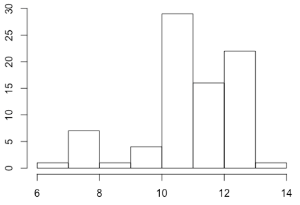

 

 
One can also define language groups using text entropy as a comparable description:

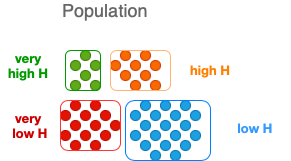

 

 

#### Grammar vs. text features 

One of the main objections to using text features for describing languages is that they are not representative of languages.

> Text &ne; language!  

We have actually tested this claim ([Bentz et al.](https://www.aclweb.org/old_anthology/W/W16/W16-4117.pdf)) and found quite strong evidence against it.  

 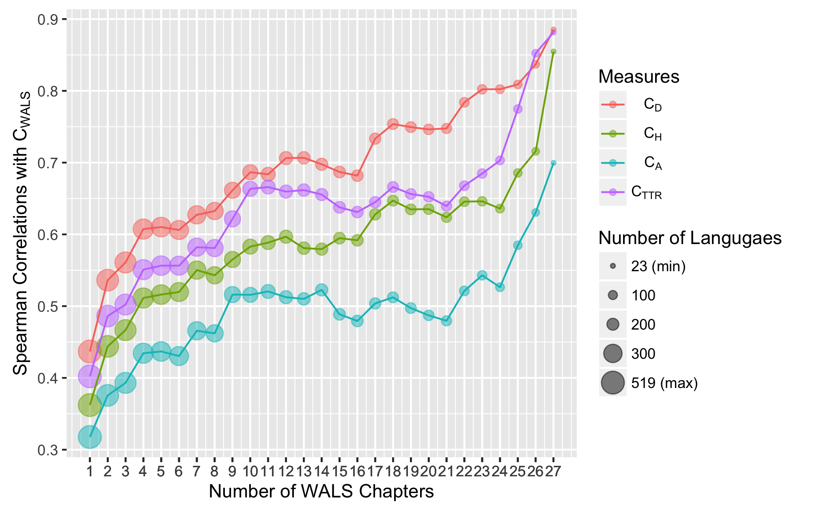

This graph shows the correlation strength between four different text measures (unigram entropy is the green line) on one side and a set of morphological features from WALS on the other. We can see that the correlation becomes really strong when enough WALS features are available. The correlation is weak when only a few WALS features are available. 

 

#### Deeper text features?

In the current work, we are looking for better text representations obtained using NLP. We presented some ideas and experiments in the SIGTYP workshop earlier this year. You might remember these two talks:

- X. Gutierrez is looking into the properties of subword units obtained with BPE, describing the languages in terms of subword **idosyncrasy** vs. **productivity**. 

[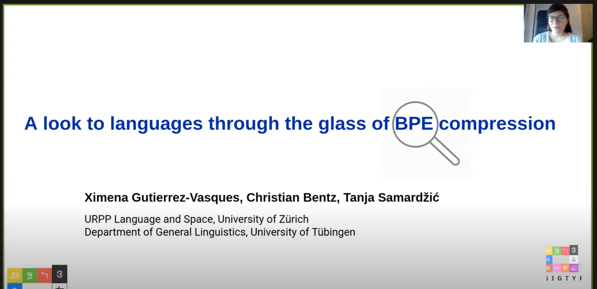](https://www.youtube.com/watch?v=jsPiDgKStnY)

 

- O. Sozinova has developed the notion of **subword geometry** as a framework for a zoomed-out description of languages according to the geometric shape of their words. 

[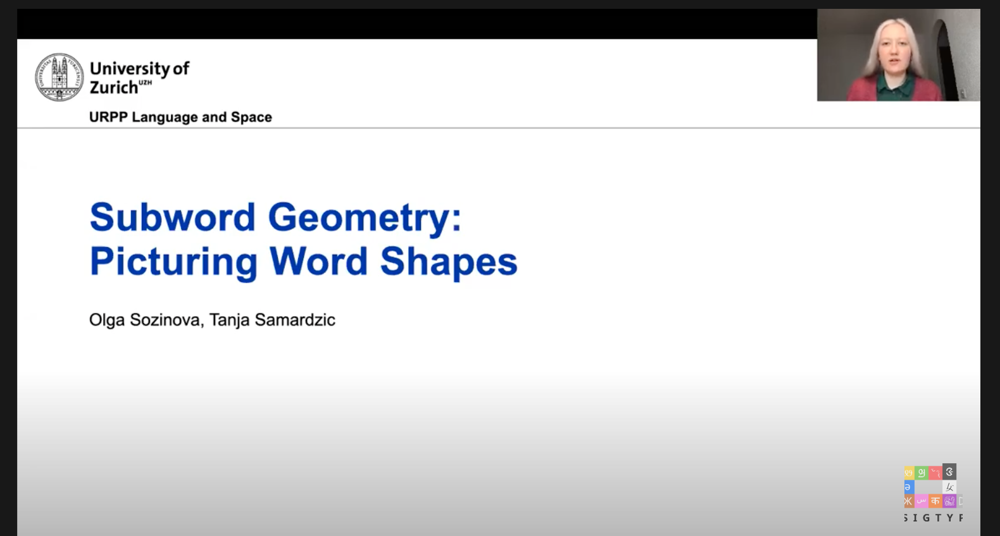](https://www.youtube.com/watch?v=jy6931sVOxE&t=349s)

 

---
## PART 3

---

### 4. Kinds of texts

#### Genres and topics

NLP work on domain adaptation usually addresses this kind of diversity, but it is not the standard in the field to cover multiple domains. The same can be said for linguistics: there is work on what is called *functional variation*, but it is rarely related to sampling, which would look something like this:

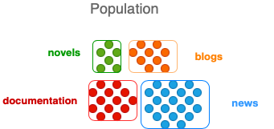

 

 

#### Regional variation 

Finally, we should not forget about regional variation, which becomes especially important in non-standard language, but it affect all genres. Many expressions differ considerably depending on the geographic area, even if the language is the same.  

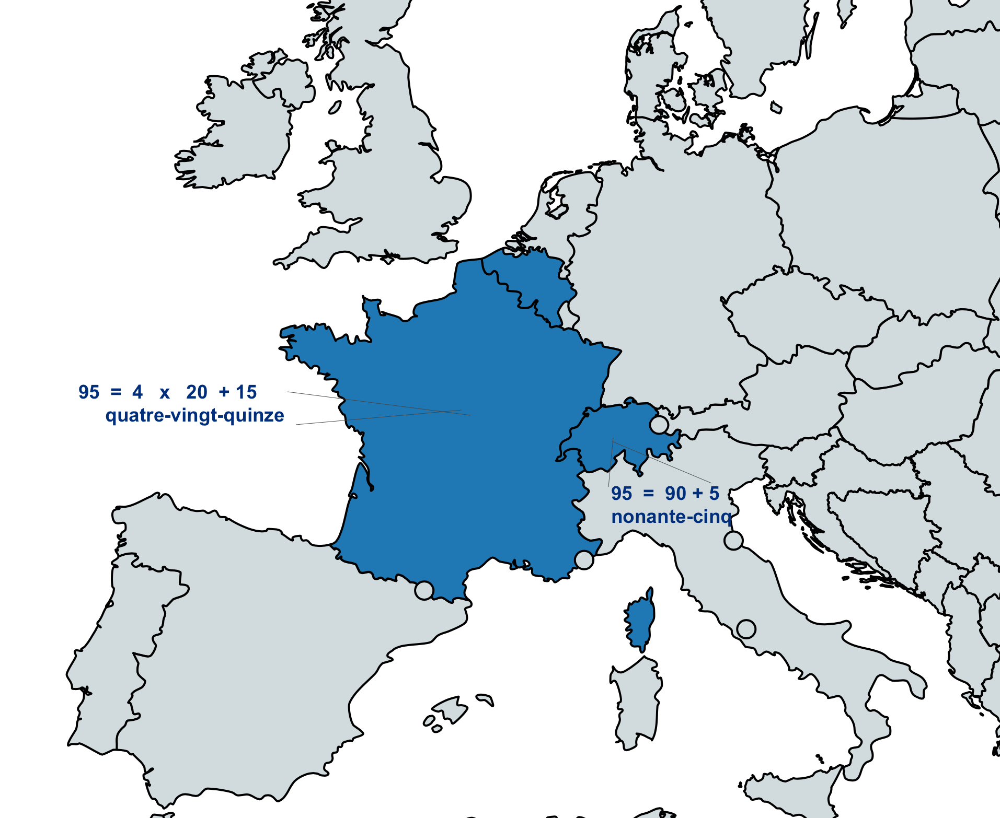

 

Following the same logic, we can split individual languages regionally, something like this (for French): 

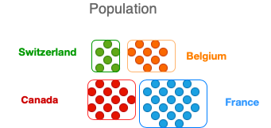

#### Data sets

Recently, multiple benchmarks (and data sets) have become fashionable in NLP. This is great from the sampling point of view, but it could be better.  

What we do most of the time (apart form the work on domain adaptation) is to train and test on the same data set, something like this:

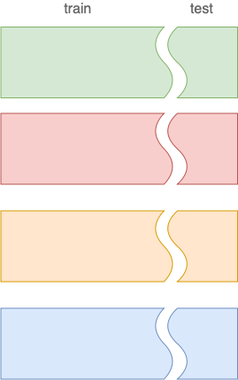

 

What we could do is train on one and test on another domain all the time:

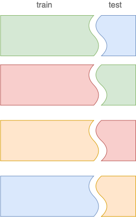

 

Of course, this would make the comparison between the models more complicated, but it would provide better estimates of the performance.  

 

--- 
## PART 4

---

### 5. The MorphDiv 100LC sample 

**SNSF project**

[Non-randomness in Morphological Diversity: A Computational Approach Based on Multilingual Corpora](https://www.spur.uzh.ch/en/departments/research/textgroup/MorphDiv.html)

Our goal is to contribute to the study of **language adaptation** and one important component is sampling. 

 

We want to be able to derive text descriptions of many languages and study their relationship with potential adaptation processes. For illustration, this graph shows a comparison of two measures, but we would like to be able to compare many different factors with texts as data points.    

#### Languages 

To cover diversity, we rely on the [WALS 100LC](https://wals.info/languoid/samples/100) sample and collect text samples for each of the included languages. Currently we have at least some data (that we are allowed to share) for 84 languages. For some more languages, we have the samples, but cannot share them yet (working on that). FInally, we might need to find replacements for a few languages. 

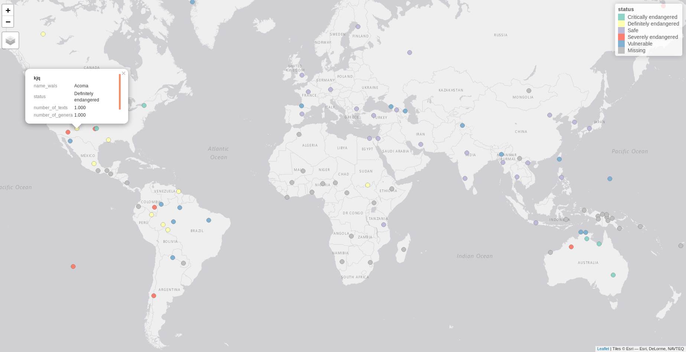

 

#### Texts

We aim at representing multiple genres using broad categories based on Biber 1991[^2]: 

> - Fiction
> -  Non-fiction
> -  Conversation
> -  Professional 
> -  Technical 
> -  Grammar examples

 

Size (based on entropy variation estimation)

> -  Maximum 100 x 50000 contiguous tokens starting from a random point
> -  Adjusted starting point for more structured text (e.g. dialogs)
> -  Whole texts if shorter than 50000

 

The sample will be freely accessible after the project (from 2022) but we will try to have a first release soon.

 

### 6. Tips for language sampling 

- Think of sampling: what do 1-3 languages tell us about language in general?
- Use predefined samples for diversity (e.g. [ACQDIV 10](https://aclanthology.org/L16-1700.pdf), [WALS 100](https://wals.info/languoid), [WALS 200](https://wals.info/languoid/samples/200))
- Try randomness (e.g. random 20 from WALS 200) 
- Think of within-language diversity: genre, regional variation 
- In NLP, prefer good estimation of the performance over good performance  
  
  --- 

[^1] J. Nichols (2013). "The vertical archipelago: Adding the third dimension to linguistic geography", From the book Space in Language and Linguistics https://doi.org/10.1515/9783110312027.38 (in case you have access)

[^2] D. Biber (1991). Variation across Speech and Writing: https://doi.org/10.1017/CBO9780511621024 (in case you have access)

