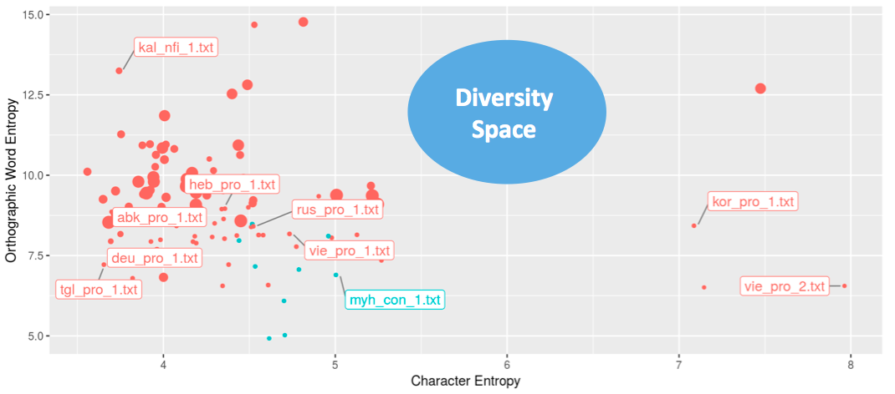

# Language sampling

SIGTYP lecture series  
Tanja Samardžić  
24.09.2021

### Learning goals

- Big picture: what is common to linguistics and NLP? 
- Scientific perspective 
- How-to tips for future study designs 

### Overview

- General sampling refresh  
- Linguistics vs. NLP
- Describing languages for stratified sampling
- Describing texts (data) for stratified sampling
- MorphDiv project: sampling texts for the WALS 100LC
- How-to

---
## PART 1

---

### 1. Sampling basics

Whenever we perform an experiment to test a model or a hypothesis, we need to decide what data to include. In NLP and linguistics, this means selecting a number of **languages** and a number of examples (sounds, words, utterances, texts) from each language. In this lecture, we will consider **texts** to be sampling examples.   How do we take this decision?

Good samples should represent the whole population that we want to study or model. 

 

####  Random sampling 

> Enumerate all the texts (past and future) in all languages (population), then select N texts randomly (sample)  
  
  &nbsp; &nbsp;  **->** &nbsp; &nbsp; Clearly impossible!

 

#### Stratified sampling

 > Enumerate all languages (population), then select N languages randomly (sample), then for each language, enumerate all the texts (population), then select N texts randomly (sample)  
  
  &nbsp; &nbsp;  **->** &nbsp; &nbsp; Starting to look imaginable, if we get lucky with the languages so that their texts are enumerable (not too many not to few) 

Samples can be more stratified. This is, for instance, what is often done: 

> Enumerate all kinds (groups, classes) of languages, then select N kinds randomly. For each of the selected kinds, enumerate all languages and select Mi languages randomly (M is proportional to the size of the group). For each selected language, enumerate all the text and select N texts randomly.  

Stratified sampling is a really good trick for representing the population well in a small sample, but for it to work, we need to know our **strata**, that is what kinds of languages and texts there are.  

 

 

### 2. Why sampling  

#### in linguistics?

The goal of linguistics is to find out how **language (= all languages!)** works. For instance, it has been shown that languages used in more isolated communities, with fewer speakers and fewer adult learners tend to have long and complex words (Lupyan and Dale 2010, Nichols 2013, Bentz and Winter 2013). 

It is evident that testing such hypotheses requires diverse samples and a good representation of the whole language population. Bias samples have been shown already to lead to wrong conclusions. For instance, Hay and Bauer (2007) found a correlation between population size and language phonetic inventory, but Moran et al. (2011) show that this correlation was due to a biased sample. Correcting for the identified bias left little support for the correlation. 

#### in NLP?

The ultimate goal of NLP applications is to assign a correct label (or representation) Y to any utterance X in any language.

Suppose we encounter a short text X (e.g. a Tweeter message), here are some Ys that we want to get right with NLP:

- Is X positive or negative? &nbsp; &nbsp; &nbsp; &nbsp; Y = {positive, negative, neutral}
- What is the topic of X? &nbsp; &nbsp; &nbsp; &nbsp; Y = {politics, sport, music, ...}
- In what language is X? &nbsp; &nbsp; &nbsp; &nbsp; Y = {Abkhaz, Acoma, Alamblak, ...}
- What is the translation of X in a language I know?  &nbsp; &nbsp; &nbsp; &nbsp; Y = translated X
 

Typically, for each Y, we have a trained **model** that outputs it once we give it X as input. This model is trained on a **sample** of texts. Our X will come from a **population** that our model is supposed to get right. 

How well will we do on X? &nbsp; &nbsp; &nbsp; &nbsp; That depends on how smart our model is, but also on:

**->** &nbsp; &nbsp; **How different X is from what we included in our training sample**  

In theory, all trained models should work for all languages: we can train the same model on any language for which we have samples and it should output Ys for the language for which it is trained. So the goal of NLP applications working for all languages boils down to having samples of all languages. We just need one language in order to figure out the models then retrain them on any desired language and that's it! This idea makes a lot of sense, but it does not seem to work in practice.

#### in both?

The problem is that we cannot design models without assuming some properties of the particular language with which we are working, as convincingly shown by [Bender (2011)](https://journals.linguisticsociety.org/elanguage/lilt/article/download/2624/2624-5403-1-PB.pdf). For instance, thinking that words are the units of processing -- something we have been doing for decades before subword tokenisation became popular -- is already an assumption about how languages are structured. It is OK to assume this if words are relatively short and simple. But words are not short and simple in most of the languages so we need to give up this assumption (which is what actually happened). 

In order to be more objective, our samples need to represent somehow **linguistic diversity**, that is different kinds of languages, in practically everything we do. Diverse samples help us avoid assumptions that don't hold. For instance, subword tokenisation was introduced in order to deal with long and complex words, but it turned out to be a better representation for all languages.  If we never thought about languages with long and complex words, we might have never found this out. 

 

---
## PART 2

---

### 3. Kinds of languages

 Describing different kinds of languages is often considered to be the main task of **linguistic typology**. This is a very hard task and, despite hundreds of years of efforts, still far from completed. The reason for this is that it is very hard to find the terms (categories) for describing languages. When describing physical objects (and beings), we can measure their height, weight, temperature, volume, etc. What do we measure in order to describe languages? 

 Here is a recent classification of languages by [Joshi et al. (2020)](https://aclanthology.org/2020.acl-main.560.pdf)

Can you guess what measure is the classification criterion here? 

For the purpose of sampling, it would be nice to be able to describe languages in a compact way using a single objective measure. For instance, we would like to be able to say something like:

> My sample consists of 
> -  5 languages of size 1
> -  6 languages of size 2 
> -  4 languages of size 3

For the moment, though, no such a measure is widely accepted. 

By the way, when talking about the *size of a language*, linguists seem to mean the *size of the population of its speakers*. This is a pity because estimating the size of a language in the sense similar to the *size of a model* could be much more interesting! 

Instead, we tend to describe languages in terms of their relation to other languages, which makes things rather complicated.  

 

#### Genealogical features

Source:

- [What trees can tell us about language evolution (and what they cannot)](https://tube.switch.ch/videos/f68d011e), SDS group, URPP Language and Space, UZH

The most common measure for describing languages is **genealogical relatedness** read off **phylogenetic trees** such as this one above. These trees are built using various knowledge sources (a little like family trees), but the most prominent techniques rely on the lists of cognates such as this example: 

> English: mother  
> Spanish: madre  
> German: mutter  
> Hindi: matri  
> Dutch: moeder  
> Latin: mater  
> Greek: meter  

The distance between two languages is measured as the number of cognates they share. It something like trying to guess who is whose cousin (and how closely related) looking at who resembles to whom. 

 

When using phylogenetic trees for describing languages, we assume that closely related languages are similar. The fact that some language belongs to a certain group implies a set of properties (those shared by its group, usually not explicitly listed). We can group languages at different levels of granularity. However, the level that is predominately used is that of **family** (only one group in the tree above).

Some quotes:

- [Tan et al. 2019](https://aclanthology.org/D19-1089.pdf)
 
> We regard the languages in the same family as similar languages and group them into one cluster. 

- [Ponti et al. 2019](https://direct.mit.edu/coli/article/45/3/559/93372/Modeling-Language-Variation-and-Universals-A)

> 

 

 

#### Grammar features 

- **[WALS features](https://wals.info/feature)** 

 

> **26A**  Prefixing vs. Suffixing in Inflectional Morphology

> Values: 
> -  Little or no inflectional morphology 
> -  Predominantly suffixing 
> -  Moderate preference for suffixing 
> -  Approximately equal amounts of suffixing and prefixing  
> -  Moderate preference for prefixing 
> -  Predominantly prefixing

> **30A** Number of Genders

> Values:
> -  None
> -  Two
> -  Three
> -  Four
> -  Five or more  

 

#### Text features 

- **Word length**

 

 

E.g. SIGMORPHON languages, Wiki texts:

 

 

- **Text complexity** -> **Entropy**

 

E.g. SIGMORPHON languages, Wiki texts:

 

 

#### Grammar vs. text features 

>  

Source: [Bentz et al.](https://www.aclweb.org/old_anthology/W/W16/W16-4117.pdf)

 

#### Deeper text features?

- **Subword regularity**

- **Subword geometry** 

 

---
## PART 3

---

### 4. Kinds of texts

#### Genres and topics

 

 

#### Regional variation 

 

 

#### Data sets

What we do:

 

 

What we should do:

 

 

--- 
## PART 4

---

### 5. The MorphDiv 100LC sample 

SNSF project

[Non-randomness in Morphological Diversity: A Computational Approach Based on Multilingual Corpora](https://www.spur.uzh.ch/en/departments/research/textgroup/MorphDiv.html)

 

#### Languages 

 

#### Texts

Genres (based on Biber 1991)

> - Fiction
> -  Non-fiction
> -  Conversation
> -  Professional 
> -  Technical 
> -  Grammar examples

 

Size (based on entropy variation estimation)

> -  Maximum 100 x 50000 contiguous tokens starting from a random point
> -  Adjusted starting point for more structured text (e.g. dialogs)
> -  Whole texts if shorter than 50000

 

 

### 6. Tips for language sampling 

- Think of sampling: what do 1-3 languages tell us about language in general?
- Use predefined samples for diversity (e.g. ACQDIV 10, WALS 100, WALS 200)
- Try randomness (e.g. random 20 from WALS 200) 
- Think of within-language diversity: genre, regional variation 
- Prefer good estimates over good performance  
  

